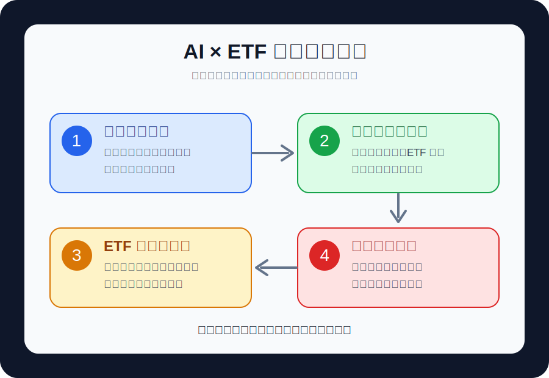

# 市場地圖：先分清楚 AI 題材、ETF 工具與投資決策
> 這堂課不教你猜明牌，而是用案例建立一套「看得懂市場、問得出好問題、做得出風險判斷」的分析流程。

## 先把三件事拆開

### 🧭 AI 題材不是同一種公司
- **上游算力**：晶片、先進製程、伺服器、散熱、電源，股價常受資本支出與接單能見度影響
- **中游平台**：雲端、資料中心、模型服務，重點在毛利率、用量成長與競爭壓力
- **下游應用**：軟體、廣告、金融、醫療與企業服務，重點在 AI 是否真的變成營收
- 同樣叫 AI，驅動因素可能完全不同，不能只看新聞標題

### 📦 ETF 是一籃股票，不是一支魔法股票
- ETF 通常是一個追蹤特定指數或主題的投資組合，買進的是一整籃資產
- 它可以降低單一公司踩雷的風險，但無法消除整個產業或整體市場下跌的風險
- 主題型 ETF 若持股集中，波動可能接近甚至高於個股
- 投資前要看：持股、權重、費用、成交量、折溢價、追蹤指數與再平衡規則

### ⚖️ 分析不是預測，是做可檢查的判斷
[flow]
1. 題材 - 這個故事是否能轉成營收與獲利
2. 資金 - 成交量、ETF 流入、法人買賣是否支持行情
3. 結構 - ETF 持股集中度、產業曝險、匯率與市場時差
4. 風險 - 哪些訊號出現時，原本的看法要被修正
[/flow]

[tags]
- [blue] 教育用途：示範分析流程，不是即時買賣建議
- [orange] 高波動：AI 與科技 ETF 常受利率、財報、政策與市場情緒影響
- [green] 重點：用規則降低情緒判斷
[/tags]

[image-text position="right" width="44"]

### 🧩 一張圖看懂分析順序
- 先問 AI 題材在哪一段供應鏈，而不是先問哪支股票會漲
- 再看 ETF 是否真的持有你想投資的資產，而不是只看名稱
- 最後把進場理由、停損條件、檢查頻率寫成規則
[/image-text]

> **市場最常見的錯誤，是把題材熱度當成投資品質**
> 一個題材很熱門，不代表每家公司都會賺錢；一檔 ETF 名稱有 AI，也不代表它的主要曝險全在 AI。
>
> 真正要問的是：錢流向哪裡？利潤留在哪裡？風險藏在哪裡？

---

# ETF 結構：買之前先看它到底裝了什麼
> ETF 的好處是方便、透明、分散；但只看名稱買進，常常會買到和想像不同的風險。

## ETF 檢查表

### 🔍 第一層：持股與權重
- 前 10 大持股是否占比過高，決定這檔 ETF 是「分散」還是「看似分散」
- 是否集中在少數大型科技股，會影響它和大盤的連動程度
- 若 ETF 追蹤 AI、半導體、雲端或機器人，要確認持股是否真的符合主題

### 💸 第二層：費用與交易成本
- 內扣費用會長期吃掉報酬，尤其是主題型 ETF 更要比較費用率
- 成交量太低，買賣價差可能變大，實際買進成本比看到的價格更高
- 海外 ETF、跨市場 ETF 可能受匯率與不同交易時段影響

### 🕒 第三層：折溢價與時差
- ETF 市價可能短時間高於或低於淨值，這叫折溢價
- 台灣掛牌的海外 ETF，若成分市場已經收盤，價格反應可能延後
- 遇到海外重大事件後，開盤第一段價格容易出現較大跳動

```prompt [label="ETF 檢查 Prompt"]
請用以下格式幫我檢查這檔 ETF：
1. 投資主題與追蹤指數
2. 前 10 大持股與集中度
3. 產業與國家曝險
4. 費用率、成交量、買賣價差
5. 可能的匯率、利率、折溢價風險
6. 這檔 ETF 適合用來表達哪一種市場觀點

請不要直接給買賣建議，先列出需要確認的資料與風險。
```

> **ETF 是工具，不是答案**
> 同樣看好 AI，有人適合買廣泛科技 ETF，有人適合半導體 ETF，也有人只適合觀察不進場。
>
> 差別不是誰比較聰明，而是每個人的資金、時間、風險承受度與檢查能力不同。

---

# 動態 AI 分析：讓 AI 做資料助理，不讓 AI 替你下判斷
> AI 最適合做的是整理、比較、提醒矛盾；最不適合做的是在資料不足時假裝有答案。

## 建立每日市場儀表板

### 📊 必看的五類訊號
[flow]
1. 價格 - 指數、ETF、主要持股是否同向
2. 量能 - 上漲有沒有成交量支持，下跌是否放量
3. 資金 - ETF 申購贖回、法人買賣、產業輪動
4. 基本面 - 營收、毛利率、庫存、資本支出、財測
5. 風險 - 利率、匯率、政策、財報空窗、評價過高
[/flow]

### 🧠 AI 可以幫你找矛盾
- 新聞說 AI 需求很強，但相關 ETF 沒有量能跟上，代表市場可能還在觀望
- 股價大漲，但主要持股只有一兩家公司帶動，代表 ETF 內部分歧很大
- ETF 淨值上升，但成交量下降，代表追價意願可能變弱
- 題材擴散到散熱、電源、伺服器零組件，代表資金可能從龍頭往供應鏈移動

```prompt [label="動態分析 Prompt"]
請用股市分析師角度整理今天的 AI 與科技 ETF 盤勢：
- 先列出資料時間，不要把盤中資料寫成收盤結論
- 分開看：指數、AI 相關 ETF、半導體 ETF、主要權重股
- 找出三個一致訊號與三個矛盾訊號
- 說明哪些變化屬於短線情緒，哪些可能影響中期趨勢
- 最後給我「需要追蹤的資料清單」，不要直接叫我買或賣
```

### 🧯 AI 回答要加三道保險
- 要求它標出資料時間，避免拿舊資料當最新資料
- 要求它分清楚事實、推論與假設
- 要求它列出反方證據，避免只找支持自己想法的內容

> **AI 不是股神，是研究助理**
> 你要把 AI 放在「幫我檢查」的位置，而不是「幫我決定」的位置。
>
> 如果 AI 的答案沒有資料時間、沒有來源、沒有風險條件，就只能當作草稿，不能當作決策依據。

---

# 案例拆解：四種常見 ETF 市場情境
> 真正有用的分析，不是把名詞背熟，而是看到市場變化時知道該問什麼。

## 案例一：AI 龍頭大漲，ETF 卻沒跟上

### 🚦 判讀重點
- 先看 ETF 是否真的重押那家龍頭，若權重不高，ETF 沒跟上很正常
- 再看其他成分股是否下跌，可能代表題材沒有擴散
- 若 ETF 成交量沒有放大，代表資金沒有全面追進
- 結論不是「ETF 壞掉」，而是「這檔 ETF 表達的市場觀點和你想像不同」

## 案例二：高股息 ETF 除息前很熱

### 🧾 判讀重點
- 高配息不等於高報酬，除息後價格會調整
- 要分清楚配息來源：股利、資本利得、收益平準金或其他來源
- 若市場只追配息率，忽略成分股景氣，可能變成短線擁擠交易
- 比較重點應該放在總報酬、波動與持股品質，而不是只看一次配息

## 案例三：債券 ETF 遇到利率變化

### 🏦 判讀重點
- 長天期債券 ETF 對利率更敏感，利率上升時價格壓力通常更大
- 若市場預期降息，債券 ETF 可能提前反應，不一定等到真的降息才動
- 要看存續期間、信用風險、匯率避險與配息來源
- 不要把債券 ETF 當成完全不會波動的定存替代品

## 案例四：AI 題材從晶片擴散到電力與散熱

### 🔌 判讀重點
- 題材擴散代表市場開始尋找第二層受益者
- 要檢查營收是否真的跟上，不要只看公司名稱與新聞關鍵字
- ETF 若持股沒有涵蓋電力、散熱、資料中心建設，就不一定吃得到這段行情
- 當估值升太快但訂單還沒確認，風險會從「看錯方向」變成「買太貴」

[tags]
- [green] 強訊號：價格、成交量、基本面同時支持
- [orange] 弱訊號：只有新聞熱，沒有量能與營收支持
- [purple] 觀察訊號：龍頭漲，供應鏈未跟；ETF 漲，成分股分歧
[/tags]

---

# 操作規則：把分析變成可執行的檢查清單
> 沒有規則的分析，很容易變成事後解釋；有規則的分析，才知道自己什麼時候看對、什麼時候該修正。

## 建立自己的投資紀錄表

### 📝 每次分析都要寫下四句話
- 我想表達的市場觀點是什麼？例如：AI 資本支出仍在擴張
- 我選的 ETF 是否真的能表達這個觀點？例如：持股是否集中在半導體供應鏈
- 什麼證據會證明我看錯？例如：營收放緩、毛利率下滑、資本支出縮減
- 我多久檢查一次？例如：每週看價格量能，每月看營收，每季看財報

### 🧱 建立部位前的三條線
[flow]
1. 進場理由 - 只要理由消失，就不能用新的故事硬撐
2. 風險上限 - 單一主題 ETF 不應大到影響生活與長期計畫
3. 檢查節奏 - 盤中看情緒，收盤看結構，財報看基本面
[/flow]

### ✅ 課後練習
- [x] 選一檔 AI、科技或半導體 ETF，整理前 10 大持股
- [x] 找出它最相關的三個風險：利率、匯率、產業景氣或政策
- [x] 寫出一個「看錯時要修正」的條件
- [x] 用 AI 產出分析草稿後，自己補上反方證據

> **真正的專業，是知道什麼時候不要動**
> 股市每天都有理由讓人衝動，但不是每天都有值得承擔風險的機會。
>
> 動態分析的價值，是讓你更早看見環境改變，而不是讓你更頻繁交易。

[summary]
- 🧭 **先拆題材** | AI 不是單一產業，要分清楚算力、平台、應用與供應鏈
- 📦 **再看 ETF** | ETF 名稱不等於曝險內容，持股、權重、費用與流動性都要檢查
- 🧠 **善用 AI** | 讓 AI 整理資料、找矛盾、列反方證據，不讓 AI 替你下單
- 🚦 **案例判讀** | 龍頭、配息、利率、題材擴散都要拆成可驗證訊號
- 🧱 **規則收尾** | 把進場理由、風險上限與修正條件寫下來，避免事後合理化
[/summary]
